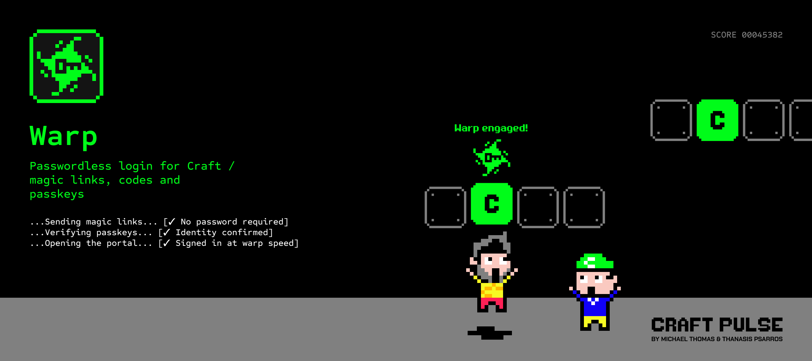
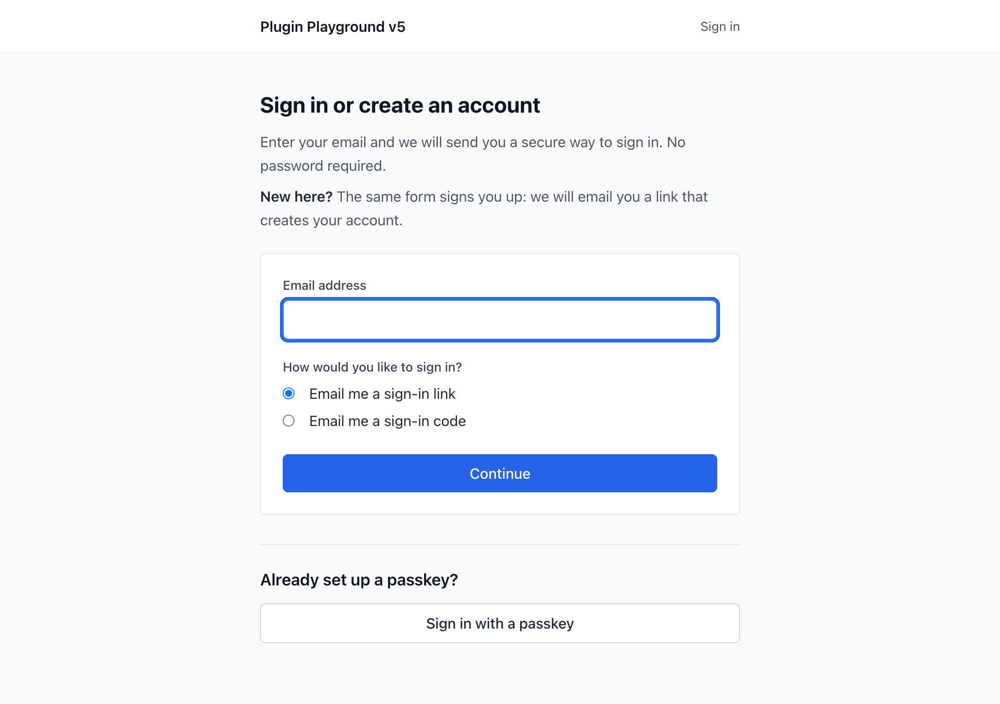

# Warp

Warp makes a Craft site's front-end member area passwordless, with magic-link and one-time-code sign-in, passkeys, registration, and session management.



## Features

- Magic-link sign-in over a single-use, rate-limited, enumeration-safe token.
- Emailed one-time codes with a per-code attempt cap and a paste-aware segmented input.
- Passkey enrollment, naming, and deletion from a front-end account screen, plus passkey sign-in.
- Passwordless registration from the same email form that signs existing members in.
- Session and device management, with per-device sign-out and a sign-out-everywhere-else action.
- Optional coarse location on sign-ins, with a new-location badge in the control panel and an optional alert email.
- Sign-in history kept for account security, pruned after 90 days, with optional IP anonymization.
- A control panel settings screen with environment-variable support, and an overview of recent sign-ins.
- A copy-in member area of complete, styled front-end templates.



## Requirements

### Craft CMS
Warp requires Craft CMS 5.10.0 or greater.

### PHP
Warp requires PHP 8.2 or greater.

### Auth Kit
Warp requires `craftpulse/craft-auth-kit` 1.8.0 or greater, which Composer installs automatically as a dependency. Auth Kit is a library rather than a plugin, so there is nothing to install or enable and it never appears in your plugins list.

## Installation

You can install Warp via the Plugin Store, or through Composer.

### Craft Plugin Store

To install **Warp**, navigate to the _Plugin Store_ section of your Craft control panel, search for `Warp`, and click the _Try_ button.

### Composer

You can also add the package to your project using Composer and the command line.

1. Open your terminal and go to your Craft project:

```shell
cd /path/to/project
```

2. Tell Composer to require the plugin:

```shell
composer require craftpulse/craft-warp
```

3. Install the plugin:

```shell
php craft plugin/install warp
```

### DDEV

If your project runs in DDEV, run the same commands through DDEV from the project root:

```shell
ddev composer require craftpulse/craft-warp
ddev craft plugin/install warp
```

## Next steps

Warp makes no changes to your site when first installed. To open a passwordless member area:

- Copy the example member area into your templates with `php craft warp/example-templates`, or `ddev craft warp/example-templates` in DDEV.
- Point Craft's `loginPath` general config setting at the copied login page, for example `members/login`.
- Open **Warp** in the control panel, choose the login methods you want, and turn registration on or off.

The [setup guide](docs/setup.md) walks through each step.

## Documentation

- [Setup](docs/setup.md): copying the example templates, page routing, system messages, registration, the passkey nudge, sessions, and multi-site notes.
- [Configuration](docs/configuration.md): every setting, the geo database, the control panel permission, read-only mode, and password handling.
- [Templates](docs/templates.md): the `craft.warp` variable, the four render builders, and how to restyle or replace everything Warp renders.
- [Endpoints](docs/endpoints.md): the ten action routes, their parameters, response shapes, and rate limits.
- [Console commands](docs/console-commands.md): installing the example templates and refreshing the geo database.
- [Privacy and GDPR](docs/privacy.md): what Warp stores, for how long, on what lawful basis, and what to disclose.

## Licensing

You can try Warp in a development environment for as long as you like. Once your site goes live, you are required to purchase a license for the plugin.

For more information, see [Craft's Commercial Plugin Licensing](https://craftcms.com/docs/5.x/extend/plugin-store.html#commercial-plugins) and [LICENSE.md](LICENSE.md).

## Support

File bugs and feature requests on the [issue tracker](https://github.com/craftpulse/craft-warp/issues). For anything else, email [support@craft-pulse.com](mailto:support@craft-pulse.com).
