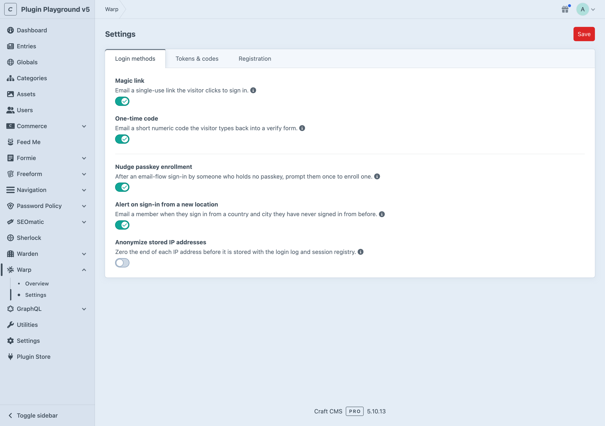

# Configuration

Warp's settings are project-config tracked, so they sync across environments.
Edit them in the control panel under **Warp** > **Settings**.

Warp applies its settings to the shared token store per request, so another
plugin using the same store keeps its own configuration and there is nothing to
reconcile between the two.

## Environment variables

Six numeric settings accept either a literal value or an environment-variable
reference such as `$WARP_TOKEN_TTL`, entered in the control panel through an
env-aware field: `tokenTtl`, `otpDigits`, `otpMaxAttempts`, `perEmailLimit`,
`perEmailWindow`, and `recentAuthDuration`.

Validation resolves the value first and range-checks the result, so a literal
and an environment variable are held to the same bounds, and a variable that
resolves to a non-number (an undefined or misspelled name) fails with a clear
message. In code, read the resolved value through the typed getters
(`getTokenTtl()`, `getOtpDigits()`, and so on), never the raw property.

## Settings



### Sign-in

#### Login methods

The passwordless channels Warp offers, as a subset of `magic-link` and `otp`.
Both are enabled by default.

A channel that is not enabled is refused at issuance even when a request asks
for it directly, so removing one closes it end to end. The set must be
non-empty, because an empty set would leave the front end with no usable login
path.

#### Token lifetime (`tokenTtl`)

How long an issued magic link or one-time code stays valid, in seconds.
Defaults to `900`, and accepts 60 to 86400.

Shorter is safer, at the cost of members who read email slowly, or on another
device, finding their link expired. Fifteen minutes is a reasonable balance for
a consumer member area; shorten it for higher-value accounts.

The emails state this value outright ("It expires in 15 minutes and can be used
only once"), so changing it changes what members are told, with no copy to keep in
sync. `craft.warp.tokenLifetime` gives your own templates the same phrase.

#### Code length (`otpDigits`)

The number of digits in an issued one-time code. Defaults to `6`, and accepts 4
to 10.

The `craft.warp.otpForm()` and `craft.warp.otpInput()` render builders read this
automatically, so the segmented input always renders exactly one square per
configured digit. Custom markup can read it through `craft.warp.otpDigits`
rather than hardcoding the length. Change the length here rather than through a
builder's `digits` option: the issuer follows this setting whatever a template
passes, so the two disagreeing makes signing in impossible.

#### Code attempts (`otpMaxAttempts`)

How many wrong guesses a single code tolerates before it is burned. Defaults to
`5`, and accepts 1 to 10.

This cap is per code. The verify endpoint adds a separate per-IP rate limit on
top of it, so lowering this is about the strength of one code, not about
throttling an attacker overall.

#### Requests per address (`perEmailLimit` and `perEmailWindow`)

The per-address issuance throttle: at most `perEmailLimit` tokens to one address
per `perEmailWindow` seconds. They default to `5` and `300`, accepting 1 to 100
and 60 to 86400 respectively.

The throttle covers every channel, including tokens issued programmatically.
The controllers add per-IP rate limiting separately, so a tight per-address
limit protects one member's mailbox from being flooded, while the per-IP limit
is what slows a broad attack.

#### Recent auth duration (`recentAuthDuration`)

How long a prior sign-in satisfies the recent-auth gate before a sensitive action
requires a step-up, in seconds. Defaults to `300`, and accepts 60 to 86400.

The gate covers passkey management: enrolling, naming and deleting credentials.
Session revocation is deliberately outside it, because signing a device out is
defensive and reversible and a member who spots something suspicious must be able
to act immediately.

The step-up for a passwordless member is simply signing in again. Raising it
spares members a re-authentication mid-session; lowering it narrows the window
in which a walk-up attacker on an unlocked device can delete a passkey.

### Registration

#### Enable registration (`enableRegistration`)

Warp's own switch for passwordless registration from the unified email form. On
by default.

It is a necessary but not sufficient condition: registration is open only when
this and Craft's `users.allowPublicRegistration` are both on. See
[registration prerequisites](setup.md#registration-prerequisites). When either
is off, an unknown address is emailed nothing and the form's HTTP response is
unchanged, so the form still reveals nothing.

#### Registration group (`registrationGroupUid`)

The UID of the user group new registrants join. Empty by default, which falls
back to Craft's own default user group.

The group is stored as a UID rather than a database id so the reference is
project-config safe and stable across environments. A UID whose group has since
been deleted also falls back to the default group, and a dangling UID is
rejected at save time.

### Passkeys

#### Passkey nudge (`enablePasskeyNudge`)

Whether to show the "add a passkey" nudge after a member signs in over an email
flow while holding no passkey. On by default.

The nudge is surfaced through `craft.warp.showPasskeyNudge`, which reads the flag
without clearing it, so it holds for the whole session and survives reloads and
posts. It ends when the member dismisses it, when they enroll a passkey, or when
the session does. See [the passkey nudge](setup.md#the-passkey-nudge). Turning
this off means the nudge is never flagged. Leave it on unless your member area
already promotes passkeys somewhere better placed.

### Location

#### New-location alerts (`notifyOnNewLocation`)

Whether to email a member when they sign in from a country and city they have
never signed in from before. On by default.

Detection requires a geo database: with none installed, no location is ever
resolved, so nothing is flagged and no alert is sent. A member's first-ever
sign-in never counts as new, because there is no baseline to compare against.
The alert copy is the editable `warp_new_location` system message.

#### Anonymize IP addresses (`anonymizeIp`)

Whether stored IP addresses are anonymized before a login-log or
session-registry row is written. Off by default.

With it on, the final octet of an IPv4 address is zeroed and an IPv6 address
keeps only its /48 network prefix. The geo lookup runs on the full address
first, so city-level location and new-location detection are unaffected. It
applies to new rows only; rows already stored keep their captured address until
they are pruned. Turn it on when your privacy posture prefers coarser addresses
over the sharper forensic value of full ones, and see the
[privacy guide](privacy.md) for the disclosure that goes with it.

## Front-end assets (`renderCss`)

Whether the render builders register Warp's baseline stylesheet. On by default,
and not surfaced in the control panel: how a site's front end is styled is a
template-and-code decision, so it lives in `config/warp.php`:

```php
<?php

return [
    // Never register Warp's baseline stylesheet. The rendered markup and the
    // client behavior are unaffected.
    'renderCss' => false,
];
```

Reach for it only when you want none of Warp's styling anywhere. You rarely need
to, because the stylesheet keeps its cosmetic rules in a `warp` cascade layer that
any ordinary rule of yours already beats, and every class it targets is
addressable from the builders. A single page can also opt out on its own with
`renderCss: false` on the builder call. The full story is in
[styling and overriding](templates.md#styling-and-overriding).

There is no equivalent for Warp's JavaScript. The two scripts are the affordance
rather than decoration, so they always load; a site wanting different markup
writes its own template against the
[DOM contract](templates.md#writing-your-own-markup).

## Geo database (MMDB)

Location awareness is optional and degrades silently. With no database
installed, logins record no city or country, the overview's Location column
shows a muted "Location unknown" badge, no sign-in is flagged as a new location,
and no alert email is sent. Installing a database lights all of that up with no
further configuration.

Warp reads a city-level MaxMind-format database (`.mmdb`) from
`storage/warp/geo/city.mmdb`. Both the flat ip-location-db record shape and the
nested MaxMind GeoIP2 or GeoLite2 shape are understood, so either can be dropped
in.

The supported way to populate it is the
[`warp/geo/refresh` command](console-commands.md#warpgeorefresh), which downloads
the database and installs it atomically. Run it on deploy or on a schedule.

The download URL is the `geoDatabaseUrl` setting. It defaults to the openly
licensed, keyless ip-location-db city database and is not surfaced in the
control panel. Point it at a different, licence-appropriate database (for
example a MaxMind GeoLite2-City URL with your account key) in `config/warp.php`,
where it also accepts an environment-variable reference:

```php
<?php

return [
    // Where `warp/geo/refresh` downloads the city database from. Defaults to
    // the keyless ip-location-db city database.
    'geoDatabaseUrl' => getenv('WARP_GEO_DATABASE_URL'),
];
```

The IP address is read only to derive the coarse city and country. It is not
persisted by the geo lookup itself, and the lookup runs entirely against the
local file, so no member IP is ever sent to a third party. This is deliberately
coarse location, never fingerprinting, and the label never influences
authorization.

## Control panel permissions

Warp registers two permissions under a **Warp** heading:

| Permission | Description |
|---|---|
| `warp:view-overview` | Grants access to the Warp overview screen. |
| `warp:manage-settings` | Grants access to the Warp settings screen. |

The overview subnav item and the `warp/overview` route are both gated on
`warp:view-overview`, so a control panel user with the plugin section but not
that permission sees no overview and gets a 403 if they navigate to it directly.
A user holding neither permission gets no Warp nav item at all. Admins
implicitly hold every permission.

Who may be on the settings screen is a permission decision; `allowAdminChanges`
decides only whether writes are possible.

## Read-only mode (`allowAdminChanges`)

Warp follows Craft's standard production posture. When `allowAdminChanges` is
`false` in `config/general.php`:

- The settings screen still renders for anyone holding `warp:manage-settings`,
  so the current configuration stays readable, but every field is disabled.
- The save action fails closed: it re-checks `allowAdminChanges` and throws a
  403 before writing anything, so a crafted POST cannot bypass the read-only
  screen.

The overview screen is read-only regardless and is unaffected. To verify, set
`CRAFT_ALLOW_ADMIN_CHANGES=false` and visit `warp/settings`: the form is visibly
disabled and a save is rejected.

## Fixed values

Two retention windows are constants rather than settings:

- **The login log** is pruned after 90 days on Craft's garbage-collection pass.
  The control panel overview is a recent-activity view, not a compliance
  archive, so the window cannot be extended.
- **The session registry** rides Craft's own garbage collection. A registry row
  whose core session has vanished is swept up, and logout forgets the exact row
  synchronously. There is no separate retention knob, because the registry
  tracks live core sessions only.

## Password handling

Warp is passwordless, and there is nothing to configure here. Stated explicitly:

- **Members created through Warp never have a password.** Registration
  provisions an active, password-less account, the same status Craft grants
  after email verification.
- **Warp never calls password validation.** It ships no password-set and no
  password-reset UI, and performs no breach checks. Mailbox possession (a magic
  link, a one-time code, or a signup link) and passkeys are the only proofs it
  accepts.
- **Password-policy cooperation happens at the Auth Kit contract layer.** A site
  that adds its own password forms elsewhere can integrate a password-strength
  or breach-check provider through Auth Kit's `PasswordValidatorInterface` and
  its validator registry. That cooperation runs between your password form and
  Auth Kit; Warp is not in the path and needs no configuration for it.

If you need password-based login for the same members, that is a different
surface. Warp neither provides nor blocks it, but it will never set a password
on a member's behalf.
