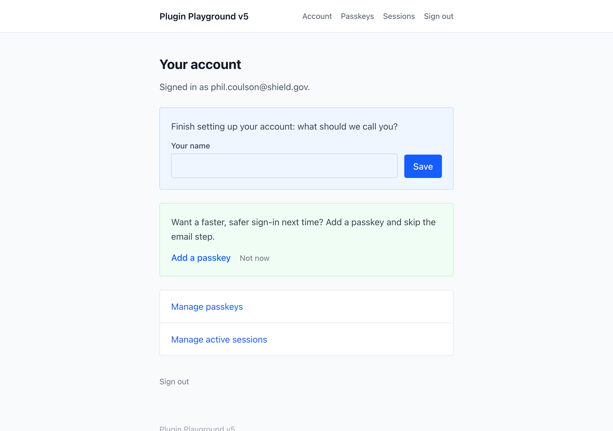

# Setup

This guide takes a fresh Warp install to a working member area: copying the
example templates, wiring your page URLs, customizing the emails, and turning on
the flows you want. For the meaning of each setting, see the
[configuration reference](configuration.md). For the Twig surface the templates
read, see the [template reference](templates.md), and for the routes they post
to, the [endpoints reference](endpoints.md).

## The shape of Warp

Warp ships two halves:

- **The back end**, which is fixed. Action routes (`warp/auth/*`,
  `warp/passkeys/*`, `warp/sessions/*`), controllers, and services are
  registered by the plugin. You never define these; you post to them.
- **The front end**, which is yours. Warp registers no site template root. It
  ships a complete member area as copy-in templates under
  `example-templates/members/`, following the same model as Craft Commerce's
  example templates: full pages extending a bundled layout, styled with
  Tailwind CSS v4 from its Play CDN, rendering the moment the folder is copied
  in.

So the pages a member visits are templates you own; the endpoints those
templates post to are Warp's.

## Installing the example templates

The quickest way in is the console command:

```shell
php craft warp/example-templates
```

```shell
ddev craft warp/example-templates
```

It prompts for a folder name (default `members`), copies the bundle into your
`templates/` directory, and names the one step left:

```
The example templates will be copied into your templates directory.
Choose a folder name: [members]
The example templates were installed at /path/to/project/templates/members.

Next step: point the loginPath general config setting at your login page,
for example ->loginPath('members/login') in config/general.php.
```

Choosing a different folder name rewrites the bundle's internal `members/...`
template paths and URLs to match, so the copy works wherever it lands, and an
existing folder is refused unless you pass `--overwrite`. See the
[console command reference](console-commands.md#warpexample-templates) for the
options. Copying `example-templates/members/` into `templates/` by hand works
just as well.

The bundle is:

```
index.twig                     redirects to the account landing
login.twig                     sign in / sign up (one unified email form)
link-sent.twig                 "check your email" confirmation (magic-link branch)
otp-verify.twig                enter the emailed one-time code
account/index.twig             signed-in landing, hosts the passkey nudge
account/passkeys.twig          enroll / name / delete passkeys
account/sessions.twig          list and revoke active sessions
account/_includes/passkey-nudge.twig   the "add a passkey" nudge and its dismissal
_private/layouts/index.twig    the shared HTML shell (head, nav, flashes)
_private/layouts/includes/header.twig  the member-area nav
```

Every page extends `members/_private/layouts`, a complete HTML document with a
skip link, a small nav, and the flash notices Warp's controllers set, so every
URL under `/members` is a valid, styled page out of the box. Each file carries
a header comment explaining what it posts to and its accessibility contract.

The bundle is meant to be edited, not treated as vendor code. Styling is
Tailwind CSS v4, loaded from its Play CDN in the layout head, the same approach
Commerce's example templates take, so it looks right with no buildchain. Tailwind
documents that CDN as development-only, which is what these pages are until you
integrate them. You have two integration paths, and both are cheap:

- **Restyle in place.** Edit the utility classes on the pages and the shell, and
  swap the CDN script for your own Tailwind build. The markup, routing, and
  interactions keep working.
- **Swap the shell.** Change the one `` line per page to your
  site's layout and keep the `` content. Because the chrome
  (skip link, nav, flash notices) lives in the shell rather than in each page,
  re-homing it is a one-liner per page.

Two of the pages render their form through a Warp builder rather than by hand, and
pass their Tailwind classes into it. Those classes are the bundle's, not Warp's:
every element the builders emit takes your attributes and every string takes your
copy, your CSS beats Warp's baseline whatever the source order, and `renderCss`
turns Warp's stylesheet off entirely. If you would rather write the markup
yourself, the [template reference](templates.md#writing-your-own-markup) has the
DOM contract and the [endpoints reference](endpoints.md) has the POST contract.

The bundle assumes it lives at `templates/members/`: every template path and
URL in it starts with `members/`. If you rename the folder after installing,
update those references throughout the bundle.

### Page URLs and Warp's routes

The page URLs are plain template routing: `templates/members/login.twig`
serves `/members/login`, and so on, with no `config/routes.php` entries
needed. Warp fixes only the action routes the forms post to
(`actionUrl('warp/auth/request')` and friends); those must not be changed.

Two behaviors worth knowing:

- **The post-sign-in destination** is `members/account`, passed as a hashed
  `redirect` and a `returnUrl`. It is where a clicked magic link, a verified
  code, or a passkey login lands the member. Warp validates the `returnUrl`
  against the base URL of the site the request was made against before honouring
  it, so an open-redirect attempt, or a destination on another site of the
  install, is dropped and the member lands on the site root instead. See
  [return URLs](endpoints.md#return-urls).
- **`link-sent` and `otp-verify`** are the neutral pages the request form
  redirects to. They must read the same whether the address was known,
  unknown, or garbage, and the example copy already does. Do not add "we could
  not find that account" messaging, which would defeat the enumeration safety
  the endpoint is built for.
- **A cold visit to `otp-verify` redirects to `login`.** The page is only
  coherent for a visitor who just asked for a code, so when no address is carried
  in the session it sends the visitor to the request form rather than showing
  "we emailed you a code" above an unexplained email field. A wrong code still
  lands back on the page normally, since the carried address survives a failed
  attempt. `craft.warp.otpForm()` keeps its email-field variant for custom
  templates that do want to accept the address there.

### Pointing Craft at the login page

One core setting completes the wiring: point Craft's `loginPath` general config
setting at the copied login page, for example `->loginPath('members/login')`.

A failed verification (an expired or reused link, a dead registration link)
redirects there, so its "invalid or expired" flash renders on a page that shows
flashes and offers a fresh request form. Without it, failures land on Craft's
default `/login` path; if `loginPath` is disabled entirely (`false` or
headless), they fall back to the site root.

## Customizing the emails

Warp's emails are four editable system messages, three of them Auth Kit's. Their
default copy ships ready to use; to change it, open the control panel and go to
**Utilities**, then **System Messages** (Craft Pro):

| Message key | Sent when |
|---|---|
| `auth_kit_magic_link` | A member requests a magic-link sign-in. |
| `auth_kit_otp` | A member requests a one-time code. |
| `auth_kit_register` | An unknown address requests sign-up, with registration open. |
| `warp_new_location` | A member signs in from a city and country they have never used. |

Edit the subject and body per site. The first three messages belong to Auth Kit,
so their copy is shared with any other Auth Kit consumer on the install: one
token store, one set of messages.

These are all standard Craft system messages, so everything that applies to
core's own emails (account activation, password reset) applies here:

- **Copy** is edited under **Utilities** > **System Messages**, per language on a
  multi-site install, with Markdown supported. Each message receives Twig
  variables you can use in the subject and body: the magic-link message gets
  `{{ link }}` and `{{ user }}`, the one-time code gets `{{ code }}` and
  `{{ user }}`, the signup link gets `{{ link }}` and `{{ email }}`, and the
  new-location alert gets `{{ user }}`, `{{ city }}`, `{{ country }}`,
  `{{ location }}`, and `{{ sessionsUrl }}`.
- **The expiry is stated, not hedged.** The three Auth Kit messages also get
  `{{ expiresIn }}`, the credential's lifetime formatted for reading, and the
  default copy uses it: "It expires in 15 minutes and can be used only once." It
  follows the `tokenTtl` setting, so raising the TTL updates the emails with it.
  If you have already rewritten a body, add `{{ expiresIn }}` to your version to
  state the expiry there too. `craft.warp.tokenLifetime` gives your templates the
  same phrase, which is how the example "check your email" page quotes it.
- **Visual styling** comes from Craft's own email template setting
  (**Settings** > **Email** > **HTML Email Template**, project-config
  tracked, Craft Pro only). Point it at a site Twig template and every system
  email, Warp's included, renders inside your branded HTML wrapper. No Warp
  configuration is involved, and the plain-text alternative Craft generates
  stays intact. Without a custom template, or on Craft Solo, emails use Craft's
  plain default wrapper.

The three sign-in messages are Auth Kit's, so the levers on them are documented
in full over there: editing the copy, translating the defaults through the
`auth-kit` translation category, and which language an email renders in. See
[Auth Kit's email documentation](https://github.com/craftpulse/craft-auth-kit/blob/v5/docs/feature-tour/templates.md#emails).
The `warp_new_location` alert is Warp's own and works the same way.

### Styling the emails

The wrapper is an ordinary site Twig template. It receives `body`, the
message's parsed Markdown as ready-to-print HTML, plus the same variables the
message body gets (`user`, `link`, `code`, and so on), in case the wrapper
wants them. A minimal `templates/_emails/wrapper.twig`:

```twig
<!DOCTYPE html>
<html lang="{{ craft.app.language }}">
<head>
    <meta charset="utf-8">
</head>
<body style="margin: 0; padding: 0; background: #f3f4f6;">
    <table role="presentation" width="100%" cellpadding="0" cellspacing="0">
        <tr>
            <td align="center" style="padding: 32px 16px;">
                <table role="presentation" width="600" cellpadding="0" cellspacing="0"
                       style="background: #ffffff; border-radius: 8px; padding: 32px; font-family: sans-serif; color: #111827;">
                    <tr><td>
                        {# Your logo/header here #}
                        {{ body }}
                        {# Your footer here #}
                    </td></tr>
                </table>
            </td>
        </tr>
    </table>
</body>
</html>
```

Set **HTML Email Template** to `_emails/wrapper` and send a test from the
same screen (**Settings** > **Email** > **Test**); a passwordless sign-in
request from the front end then arrives styled. See
[Craft's mail documentation](https://craftcms.com/docs/5.x/system/mail.html)
for the full mail-settings reference, including per-environment overrides via
`config/app.php`.

## Registration prerequisites

Passwordless registration turns on only when **both** switches are on:

1. **Warp's own `enableRegistration` setting**, on the Warp settings screen,
   default on.
2. **Craft's public-registration switch.** This is the core
   `users.allowPublicRegistration` value in project config, the same switch
   Craft's own front-end registration checks. It is not a `config/general.php`
   setting: set it in the control panel under **Settings** > **Users** >
   **Settings**.

When either switch is off, the unified email form silently degrades to
login-only: an unknown address is emailed nothing, and the HTTP response is
unchanged, so the form still never reveals whether registration is open.

> [!WARNING]
> The silence is the enumeration safety working, which makes a half-configured
> install invisible from the browser: with only one switch on, a sign-up attempt
> still answers "If an account matches that address, a sign-in message is on its
> way." and no email is ever sent. If sign-up emails never arrive, check both
> switches before anything else.

New members join the group named by Warp's `registrationGroupUid` setting, or
Craft's default user group when that is unset. They are created active with no
password; verifying the signup link is the proof.

## The passkey nudge

After a member signs in over an email flow (magic link, code, or a fresh signup)
while holding no passkey, Warp flags a nudge inviting them to add one. The nudge
is surfaced by `account/_includes/passkey-nudge.twig`, which `account/index.twig`
includes on the signed-in landing page.



Reading `craft.warp.showPasskeyNudge` does **not** clear the flag. The nudge holds
for the rest of the session, so a page reload, a form post that lands the member
back on the same page (saving their name, for instance), and a second read in one
request all still show it. Three things end it:

- **"Not now."** The include posts to
  [`warp/nudge/dismiss`](endpoints.md#warpnudgedismiss), which clears the session
  flag. The control is a real form, so it works with no JavaScript; the script in
  the include upgrades it to a background post that removes the section in place.
- **Enrolling a passkey.** The variable re-checks that on every read, so the
  nudge disappears the moment a credential exists, without waiting for the next
  sign-in.
- **The session ending.** The next email-flow sign-in flags it again if the
  member still holds no passkey.

Turn the nudge off entirely with the `enablePasskeyNudge` setting.

## The sessions page

`account/sessions.twig` lists the member's active sessions through
`craft.warp.sessions`. Each row is a live Craft session joined to Warp's device
registry for a friendly label; the session making the request wears a "This
device" badge and has no per-row sign-out button, since the normal sign-out link
ends it. Other rows offer a per-row "Sign out", and a "Sign out everywhere else"
button clears every session but the current one.

A session created before Warp was installed, or by a path Warp does not capture,
has no registry row and renders as "Unknown device" with no per-row button. It
carries no handle to target individually, but "Sign out everywhere else" still
clears it.

Neither revoke endpoint is recent-auth gated, deliberately. Signing a device out
is defensive and reversible, so a member who spots something suspicious can act
immediately however old their own session is. The step-up stays on passkey
management, where the action is destructive: those endpoints answer
`reauthRequired` and the example `account/passkeys.twig` page handles it. Signing
in again is the re-authentication; passwordless members have no password to
re-confirm.

## Multi-site notes

Warp builds magic-link, code, and registration verify URLs with Craft's
site-aware URL helpers at issuance time, so a link **lands on the site that
issued it**. A member who requested a link from your Dutch site clicks through to
the Dutch site, not the primary one.

Two consequences for a multi-site member area:

- Serve the copied templates on each site that offers passwordless login, at the
  URLs that site expects. The post-sign-in destination and the page routing are
  per-template, so a site-specific template can point at site-specific routes.
- `returnUrl` validation is scoped to **one site**, not to the install: a
  `returnUrl` is honoured only when it belongs to the site the request was made
  against, so a form on your Dutch site cannot send a member to your French one.
  It is refused like any other untrusted value and the member lands on the
  fallback instead. That is also what you want: sessions are per cookie domain, so
  a member sent to a site on another domain would have arrived signed out. Sites
  sharing a host and differing only by path prefix each own their own URLs. See
  [return URLs](endpoints.md#return-urls).

## Privacy disclosure

Warp records sign-in history (IP address, coarse location, device label) for
account security, which belongs in your site's privacy policy. The
[privacy guide](privacy.md) has the data inventory, retention windows, the
lawful-basis notes, and suggested disclosure wording, plus the optional
`anonymizeIp` setting for deployments that must not store full addresses.
